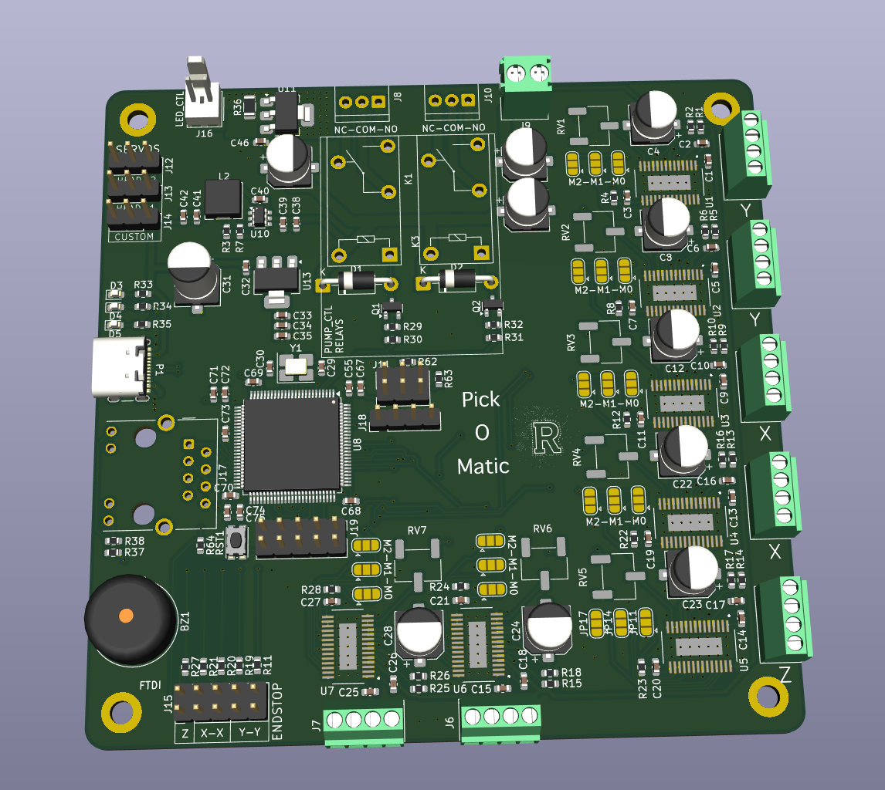
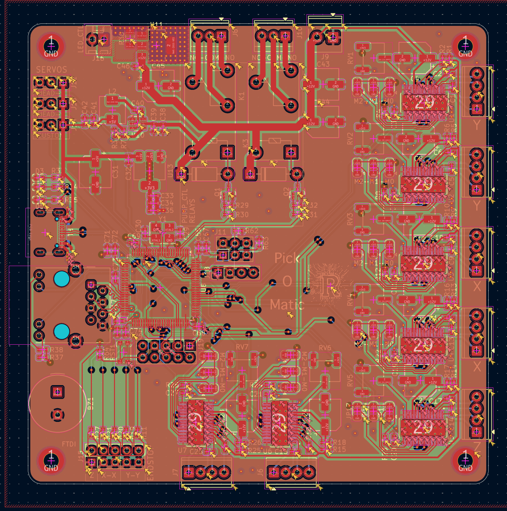
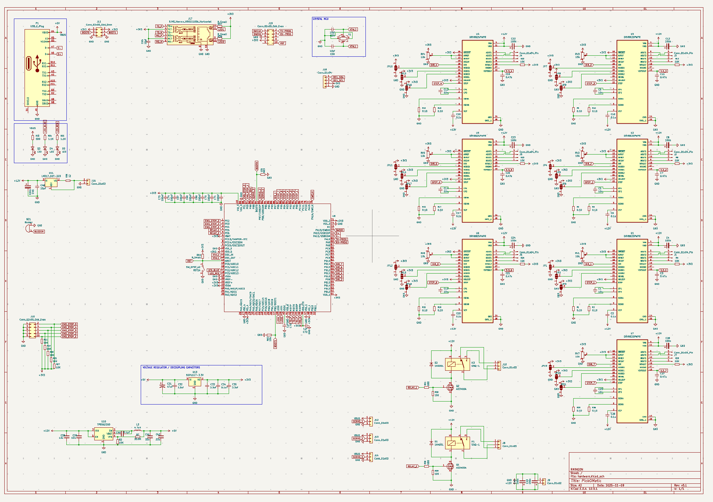

# PickOMatic V2

> **Place faster. Place smarter. The open-source motion controller that turns your pick-and-place ambitions into production reality.**

<p align="center">
  
</p>

<p align="center">
  <a href="LICENSE"></a>
  
  
  
</p>

---

**PickOMatic V2** is a professional-grade, all-in-one motion control board designed from the ground up for desktop pick-and-place machines. It is the second generation of the [PickOMatic](https://github.com/rmingon/PickOMatic) motion controller, rebuilt around a modern 32-bit **RISC-V** microcontroller with native **Ethernet** and **USB-C** connectivity.

One board drives the entire machine: gantry, picker heads, nozzles, vacuum, lighting and feedback, with no shields, no breakout spaghetti and no compromises.

## Highlights

- **RISC-V power** : WCH **CH32V317VCT6** (QingKe 32-bit RISC-V core, LQFP-100), a massive leap over the 8-bit ATmega2560 of V1
- **7 stepper channels** : on-board **DRV8825** drivers for the XY gantry, Z axis and auxiliary picker-head axes, each with per-channel microstepping selection (M0/M1/M2 solder jumpers) and current trim
- **Ethernet on board** : integrated PHY with RJ45 magjack (HR911105A) for fast, reliable G-code streaming over the network
- **USB-C** : modern connectivity for setup, control and firmware workflows
- **Vacuum and pneumatics** : dedicated relay outputs (NC-COM-NO) for the vacuum pump and pneumatic accessories
- **3 servo outputs** : independent nozzle height / rotation control per picker head
- **5 endstop inputs** : dedicated limit-switch inputs for X, Y and Z homing (dual X and dual Y supported)
- **Inspection lighting** : dedicated LED control output for camera lighting
- **Operator feedback** : on-board buzzer and status LEDs
- **Expansion ready** : I²C bus, custom headers, FTDI UART header, SWD debug port and BOOT jumpers
- **Clean power architecture** : single 12 V input with on-board buck converters (TPS562200) and LDO rails for logic

## What's new in V2

| | PickOMatic V1 | **PickOMatic V2** |
|---|---|---|
| Microcontroller | ATmega2560 @ 16 MHz (8-bit AVR) | **CH32V317VCT6 (32-bit RISC-V)** |
| Host link | USB-UART (CH340C) | **Native USB-C + Ethernet (RJ45)** |
| Stepper channels | 8 | 7 x DRV8825 with per-axis microstep jumpers |
| Debug / programming | AVR-ISP | **SWD + FTDI UART + BOOT jumpers** |
| Networking | None | **On-board Ethernet PHY + magjack** |

## Board overview

| PCB layout | Schematic |
|:---:|:---:|
|  |  |

## Specifications

| Subsystem | Detail |
|---|---|
| MCU | WCH CH32V317VCT6, 32-bit RISC-V, LQFP-100, external crystal |
| Motion | 7 x DRV8825 stepper drivers (STEP/DIR), microstepping via M0/M1/M2 solder jumpers, current trim potentiometers |
| Axes | Dual-Y and dual-X gantry support, Z axis, auxiliary picker-head channels |
| Endstops | 5 inputs (Z, X-X, Y-Y) on a dedicated header |
| Servos | 3 PWM outputs for nozzle actuation |
| Pneumatics | Relay outputs with NC-COM-NO terminals for vacuum pump control |
| Lighting | Dedicated LED_CTL output for inspection lighting |
| Connectivity | USB-C, 10M Ethernet (RJ45 HR911105A), I²C expansion, FTDI UART |
| Debug | SWD (SWCLK/SWDIO), BOOT0/BOOT1 jumpers, reset button |
| Feedback | Buzzer, status LEDs |
| Power input | 12 V DC via screw terminal |
| Power rails | 12 V motor rail, 5 V and 3.3 V logic rails (TPS562200 buck converters + LDOs) |
| Form factor | 4-corner mounting holes, screw-terminal I/O on board edges |

## Repository structure

```
PickOMatic-V2/
├── hardware/               # KiCad project (schematic + PCB)
│   ├── hardware.kicad_pro
│   ├── hardware.kicad_sch
│   └── hardware.kicad_pcb
├── 3d.png                  # 3D render of the assembled board
├── pcb.png                 # PCB layout view
├── schematic.png           # Full schematic
├── LICENSE                 # CERN-OHL-S v2
└── README.md
```

## Getting started

1. **Clone** the repository
   ```bash
   git clone https://github.com/rmingon/PickOMatic-V2.git
   ```
2. **Open** `hardware/hardware.kicad_pro` in [KiCad](https://www.kicad.org/) (version 8 or later recommended)
3. **Review** the schematic and PCB, then export Gerbers and the BOM for your fab house
4. **Assemble**, set the DRV8825 current limits, configure microstepping with the solder jumpers, and connect your motors, endstops, servos and vacuum pump
5. **Flash** your firmware via SWD or the FTDI/BOOT bootloader path, and start placing parts

## Related projects

- [PickOMatic (V1)](https://github.com/rmingon/PickOMatic) : the original ATmega2560-based motion controller this board evolved from

## Contributing

Issues and pull requests are welcome. If you build a machine around PickOMatic V2, share it: photos, firmware ports and feeder designs all help the project grow.

## License

This project is open-source hardware, released under the **CERN Open Hardware Licence Version 2, Strongly Reciprocal (CERN-OHL-S-2.0)**.

You may use, study, modify, manufacture and distribute this design, provided that any modified versions are released under the same licence and that source is made available. See [LICENSE](LICENSE) for the full text.

Copyright © 2026 [rmingon](https://github.com/rmingon)

---

<p align="center"><i>PickOMatic V2, because your components deserve to be placed with confidence.</i></p>
